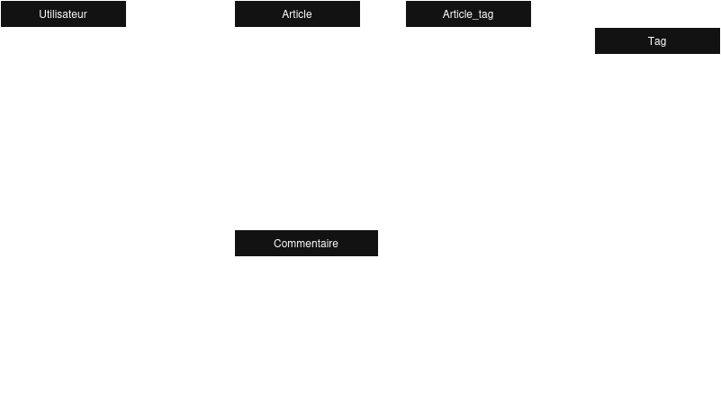

# Projet DD

**Groupe**
CHARRIER Evan, GAULTIER Mathis , MONTIÈGE Hugo, KOUMBA Elisia

**Sujet** :
Mettre en évidence les avantages et inconvénients liés au choix de l'architecture du SGBD (NoSQL/Relationnel) d'un point
de vue développement, conception et performance.


---

## Objectifs du projet

- Comparer les approches NoSQL (**MongoDB**) et relationnelle (**PostgreSQL**) pour un cas d'usage concret : un système
  de blog avec articles, commentaires, utilisateurs, etc.
- Illustrer les forces et faiblesses de chaque architecture en termes de :
    - **Flexibilité du schéma**
    - **Complexité de développement**
    - **Évolutivité**
- Produire un notebook synthétique pour présenter les résultats.

Ce projet a pour objectif de sensibiliser les développeurs et les architectes logiciels à l'importance du choix du SGBD.
Le choix du SGBD pour un projet est parfois basé uniquement sur l'expérience ou les préférences de certaines personnes.

Ce choix, souvent basé sur l'expérience ou les préférences personnelles, a des implications majeures. Chaque SGBD
possède des spécificités, des avantages et des inconvénients. Nous nous concentrons ici sur les différences entre les
SGBD **SQL** (*Structured Query Language*) et **NoSQL** (*Not Only SQL*).
Nous avons donc choisi d'utiliser **PostgreSQL** et **MongoDB** qui sont deux SGBDs extrêmement utilisés. Le premier est
un SGBD relationnel, tandis que le second est non relationnel et orienté documents.

Ce projet permet de mettre en évidence que l'utilisation d'un SGBD se fait principalement en fonction des besoins
métiers. L'objectif est de montrer que le choix d'un SGBD doit être guidé par les **besoins métiers** et les
**contraintes techniques** du projet. Un mauvais choix peut compliquer le développement, la maintenance et l'évolution
du logiciel, tout en dégradant les performances et l'expérience utilisateur (ex. : temps de chargement accrus).

---

## Organisation du projet

Pour ce projet, nous avons simulé une base de données d'un blog avec des données utilisateurs (`users`) et des données
articles (`posts`). Ces données sont enregistrées dans le répertoire `datasets`.

Le répertoire `mongodb` contient les scripts spécifiques à l'utilisation de *mongodb* ainsi qu'un fichier
`requirements.txt` afin de créer un environnement virtuel Python pour les scripts.
Le répertoire `postgresql` contient les scripts spécifiques à l'utilisation de *PostgreSQL* ainsi qu'un fichier
`requirements.txt` afin de créer un environnement virtuel Python pour les scripts. Ce répertoire contient aussi un
fichier `README.md` détaillant le fonctionnement et l'utilisation des scripts.

Nous avons choisi de ne pas mesurer les temps d'exécution des requêtes pour nous concentrer sur les aspects
**architecturaux**, **d'implémentation** et de **maintenance**. En effet, les temps d'exécution relève d'un aspect
optimisation et dépendent de nombreux facteurs, comme la machine, la taille de la base, etc.

## MongoDB

Afin d'exécuter les scripts du répertoire Mongo, il faut se placer dans un environnement virtuel et installer les
dépendances avec `pip install -r requirements.txt`.

### Mise en place de la base de données

Le fichier `import.py`, initialise et remplit la base de données à partir des fichiers du répertoire
`datasets`. Si la base de données n'existe pas, en revanche, si elle existe les données sont supprimées pour remettre
les données d'origine. Cela permet de facilement remettre à zéro la base suite à des modifications ou à l'exécution de
requêtes.

### Exécution des requêtes

Le fichier nommé `queries.py` contient de nombreuses requêtes à exécuter sur la base de données Mongo.
Les requêtes présentes dans ce fichier sont des exemples de requêtes qui mettent en évidence la flexibilité de MongoDB
et plus particulièrement des bases de données non-relationnelles.

Ces requêtes illustrent les aspects :

- Modification dynamique du schéma (ajout de champs, gestion de données imbriquées).
- Utilisation de requêtes complexes (agrégations, expressions régulières).
- Gestion de métadonnées personnalisées sans migration de schéma.

Voici un extrait des requêtes présentes dans ce fichier :

```python
# Ajout d'une note à un article
posts_col = db['posts']

myquery = {"titre": "Pourquoi MongoDB est idéal pour les blogs modernes"}
newvalues = {"$set": {"note": 4.5}}

posts_col.update_one(myquery, newvalues)

# Cette première requête montre la flexibilité de mongo et la facilité de modification du schéma de la base.
# Les modifications de schéma peuvent gérer de nombreuses choses comme les commentaires imbriqués par exemple.

# ---------------------------------------------------------------------------------------------------------------------

# Recherche d'une regex dans un commentaire
regex = "Mongo"

pipeline = [
    # Filtre les articles qui ont un commentaire contenant la regex
    {
        "$match": {
            "commentaires.contenu": {"$regex": regex, "$options": "i"}
        }
    },
    # Sélection des champs
    {
        "$project": {
            "titre": 1,
            "auteur": 1,
            "note": 1,
            "commentaires": {
                "$filter": {
                    "input": "$commentaires",
                    "as": "commentaire",
                    "cond": {
                        "$regexMatch": {"input": "$$commentaire.contenu", "regex": regex, "options": "i"}}
                }
            }
        }
    }
]

resultats = list(posts_col.aggregate(pipeline))

# ---------------------------------------------------------------------------------------------------------------------

# Ajout de meta data personnalisée à un post
posts_col.update_one(
    {"titre": "Mariette : une révolution culinaire ?"},
    {
        "$set": {
            "metadonnees": {
                "type": "culinaire",
                "ingredients": ["tacos", "sauce secrète", "fromage"],
                "temps_preparation_min": 15,
                "prix": "abordable",
                "note_nutritionnelle": {
                    "calories": 850,
                    "protéines_g": 200
                }
            }
        }
    }
)

# Cette requête modifie la structure de la base en ajoutant un nouveau champ à un post. Elle montre aussi que 
# l'utilisation des bases de données non-relationnelles permet de relier directement un objet à une liste, ce qui est 
# déconseillé avec des bases de données relationnelles et l'une des premières choses que l'on apprend lorsque l'on 
# souhaite manipuler des bases de données.
```

## PostgreSQL

La mise en place de l'environnement afin d'exécuter les requêtes PostgreSQL est expliquée dans le fichier
`postgresql/README.MD`. Tout comme Mongo, nous vous conseillons d'utiliser un environnement virtuel Python.

### Mise en place de la base de données

Le fichier `script_init.sql` du répertoire `schema` permet de créer la base de données PostgreSQL ainsi qu'un
utilisateur associé.

Ensuite le schéma de la base de données est créé, il peut être illustré de cette façon :


### Comparaison avec MongoDB

Contrairement à l'implémentation en Mongo qui contient seulement deux objets, cette implémentation est plus complexe.
Les commentaires ne sont pas directement imbriqués dans les articles.
De plus l'associations des articles à des meta-data (tags) est complexe, car chaque tag est un objet de la classe tag.
La
relation Article-Tag est donc une relation \*-\* qui implique de créer une classe intermédiaire nommée *Article_tag*.

La création d'une base de données SQL est donc plus longue qu'une base de données non-relationnelle, mais force
l'architecte à se poser des questions afin d'optimiser sa base et d'anticiper les évolutions.

Nous observons aussi que plus de type de données sont supportés par les systemes relationnels. Ce schéma utilise des
types *Date* et *Timestamp* qui ne sont pas supportés nativement par un système comme Mongo DB. En effet, Mongo supporte
les types du format JSON qui sont les chaînes de caractères et les nombres.

Les évolutions de la base de données sont aussi plus complexes. Par exemple l'ajout d'un attribut note aux articles
implique de modifier la table des articles, de définir une valeur par défaut qui sera assignée à tous les articles qui
existent déjà. Cela vient du fait que tous les éléments d'une même table doivent suivre la même architecture ces
migrations sont coûteuses en temps et en ressource, mais peuvent aussi engendrer des bugs dans le système.

### Exécution des requêtes

Le fichier nommé `queries.py` contient de nombreuses requêtes pouvant être exécutées sur la base de données.
Les requêtes présentes dans ce fichier sont des exemples de requêtes qui mettent en évidence les avantages liés à
l'utilisation d'un SGBD relationnel comme PostgreSQL.

Voici les éléments mis en avant :

- Requêtes récursives (ex. : hiérarchie de commentaires).
- Agrégations complexes (statistiques utilisateurs).
- Jointures optimisées pour l'analyse de données relationnelles.

Voici un exemple de requêtes présentes dans ce fichier :

```postgresql
-- Sélection des commentaires d'un article
WITH RECURSIVE comment_hierarchy AS (
    -- Commentaires racines (sans parent)
    SELECT c.id_commentaire,
           c.contenu,
           c.date,
           c.id_article,
           c.id_parent,
           u.nom                               AS auteur,
           0                                   AS niveau,
           ARRAY [c.id_commentaire]::VARCHAR[] AS path
    FROM Commentaire c
             INNER JOIN Utilisateur u ON c.id_utilisateur = u.id_utilisateur
    WHERE c.id_article = (SELECT id_article
                          FROM Article
                          WHERE titre = 'Pourquoi MongoDB est idéal pour les blogs modernes')
      AND c.id_parent IS NULL

    UNION ALL

    -- Commentaires enfants (récursif)
    SELECT c.id_commentaire,
           c.contenu,
           c.date,
           c.id_article,
           c.id_parent,
           u.nom AS auteur,
           ch.niveau + 1,
           ch.path || c.id_commentaire
    FROM Commentaire c
             INNER JOIN Utilisateur u ON c.id_utilisateur = u.id_utilisateur
             INNER JOIN comment_hierarchy ch ON c.id_parent = ch.id_commentaire)
SELECT id_commentaire,
       contenu,
       date,
       auteur,
       niveau,
       REPEAT('  ', niveau) || auteur || ': ' || LEFT(contenu, 50) AS affichage
FROM comment_hierarchy
ORDER BY path;

-- Cette requête montre que la récursivité est supportée par les SGBD utilisant le SQL et donc relationnel.

-------------------------------------------------------------------------------------------------------------------------

-- Sélection de statistiques à propos des utilisateurs (nombre d'article écrit, nombre de vue en moyenne, etc) 

SELECT u.id_utilisateur,
       u.nom,
       u.email,
       u.role,
       COUNT(DISTINCT a.id_article)     AS nb_articles,
       COUNT(DISTINCT c.id_commentaire) AS nb_commentaires,
       COALESCE(SUM(a.vue), 0)          AS total_vues,
       COALESCE(AVG(a.note), 0)         AS note_moyenne
FROM Utilisateur u
         LEFT JOIN Article a ON u.id_utilisateur = a.id_utilisateur
         LEFT JOIN Commentaire c ON u.id_utilisateur = c.id_utilisateur
GROUP BY u.id_utilisateur, u.nom, u.email, u.role
ORDER BY total_vues DESC;


-- Le langage SQL offre la possibilité d'appliquer directement des fonctions mathématique sur le résultat des requêtes
```

## Conclusion

### Synthèse des enseignements

Le choix entre un SGBD **NoSQL** (comme MongoDB) et un SGBD **relationnel** (comme PostgreSQL) dépend avant tout des
**besoins métiers**, des **contraintes techniques** et des **priorités du projet**.
Cette étude comparative, basée sur un cas d'usage concret (un système de blog), met en lumière les forces et les limites
de chaque approche.

**MongoDB** semble idéal pour les **proofs of concept (POC)**, les projets nécessitant une **mise en place rapide**, ou
encore pour gérer des **données non structurées** ou en constante évolution.
Sa flexibilité permet d'ajouter ou de modifier des champs sans migration complexe, et sa gestion native des **données
imbriquées** (comme les commentaires d'un article) simplifie grandement le développement.
Par exemple, avec une seule requête, il est possible de récupérer **tous les commentaires d'un article**, y compris ceux
imbriqués, sans avoir besoin de jointures.
Cependant, cette approche présente des limites : MongoDB ne gère pas les **cycles** dans les relations (un commentaire
ne peut pas être son propre parent, contrairement à un modèle relationnel), et la dénormalisation peut entraîner des
redondances ou des incohérences si elle n'est pas maîtrisée.

À l'inverse, **PostgreSQL** est adapté dans les projets où l'**intégrité relationnelle** est cruciale.
L'intégrité relationnelle garantit que les relations entre les tables sont toujours valides (ex. : un commentaire ne
peut exister sans un article associé, et toute suppression d'article doit être propagée aux commentaires).
Ce système est particulièrement adapté aux applications où les données sont **fortement structurées** et où les requêtes
complexes (jointures, agrégations, sous-requêtes) sont fréquentes.
Par exemple, la gestion des **commentaires imbriqués** sous forme d'arbre (avec récursivité) permet de modéliser des
hiérarchies complexes, y compris des **cycles** si nécessaire. Cependant, cette rigueur a un coût : les évolutions du
schéma (ajout de champs, modifications de types) nécessitent des **migrations coûteuses** pouvant engendrer des bugs si
le système n'est pas prêt à accepter ces modifications de schéma.

---

### SGBD hybrides

Face à ces constats, les **SGBD hybrides** semble être une partie de la solution.
L'extension **JSONB** de PostgreSQL, permet de combiner les avantages des deux types de SGBD : la **rigueur
relationnelle** pour les données structurées et la **flexibilité NoSQL** pour les données semi-structurées.
Cette approche est particulièrement utile pour les projets où certaines parties des données évoluent fréquemment, tandis
que d'autres restent stables.

**JSONB**, est un type de données PostgreSQL qui permet de stocker des données au format JSON dans un **format binaire
optimisé**. Contrairement au type `JSON` classique, **JSONB** offre de meilleures performances pour les requêtes et les
manipulations, tout en supportant des opérateurs et des fonctions.
De plus, il est compatible avec plusieurs types d'**index** (B-tree, Hash), ce qui améliore les performances des
recherches.

Un autre aspect souvent sous-estimé est **l'impact du choix du SGBD sur la sécurité**. Les SGBD relationnels, grâce à
leur maturité, offrent des mécanismes robustes contre les **injections SQL**, tandis que les bases NoSQL, bien que moins
ciblées historiquement, nécessitent une vigilance accrue face aux **injections NoSQL**.

---

### SGBD spécialisés

Dans certains cas, des SGBD généralistes peuvent ne pas suffir pour répondre aux besoins métier.
C'est pour cela que des SGBD spécialisé ont été créés pour des cas d'usage spécifiques :

- **SGBD temporels** (ex. : TimescaleDB) : optimisés pour les données temporelles (séries temporelles, logs, ...).
  Ils permettent des requêtes efficaces sur des plages de temps, avec des fonctions dédiées.
- **SGBD géospatiaux** (ex. : PostGIS) : conçus pour gérer des données géographiques (cartographie, SIG). Ils
  intègrent des index et des requêtes spatiales (ex. : "trouver tous les points correspondant à un critère dans un rayon
  de 10 km").
- **SGBD pour données climatiques** (ex. : InfluxDB, Apache Druid) : optimisés pour le stockage et l'analyse de
  grands volumes de données environnementales, avec des fonctionnalités avancées pour les requêtes sur des métriques
  comme la température, l'humidité, ou les émissions de CO₂.

---


Ces solutions montrent que le choix d'utiliser un SGBD n'est pas anodin et doit se faire après un **travail de veille** 
pour connaitre les différentes options disponibles. Il est également essentiel de réaliser **POC** avec différents SGBD
afin de comparer leurs performances et leur adéquation avec les besoins du projet, et ce, à toutes les étapes de vie du 
système : **développement**, **maintenance**, **évolution**, et leurs comportements **sur de grands volumes de données**.

Le **SGBD optimal n'existe pas** : il est spécifique à chaque projet et dépend du domaine d'application, des
**contraintes techniques**, et des **objectifs à long terme**. Par exemple, un SGBD comme MongoDB peut être idéal pour
un projet nécessitant une **flexibilité maximale** et une **mise en place rapide**, tandis qu'un SGBD relationnel comme
PostgreSQL sera plus adapté pour des applications où l'**intégrité des données** et les **requêtes complexes** sont
critiques.

Notre projet a mis en lumière un point crucial : **partir trop précipitamment sur un SGBD sans évaluation préalable**
peut entraîner des complications majeures par la suite. Un mauvais choix peut rendre le développement plus complexe,
alourdir la maintenance, et limiter la capacité du système à évoluer. Par exemple, une base de données NoSQL mal adaptée
à des besoins relationnels peut nécessiter des **contournements coûteux** pour gérer les relations entre les données,
tandis qu'une base relationnelle mal dimensionnée peut devenir rigide et difficile à faire évoluer.

En conclusion, le choix d'un SGBD doit être **réfléchi, documenté et validé par des tests concrets**. Il est recommandé
de :

- **Définir clairement les besoins** (volume de données, types de requêtes, évolutivité).
- **Tester plusieurs solutions** via des POC pour évaluer leur adéquation.
- **Anticiper les évolutions futures** pour éviter les migrations coûteuses.
- **Considérer les compétences de l'équipe** et l'écosystème technique existant.

Grâce à cette méthodologie, on peut garantir la **pérennité**, la **performance** et la **maintenabilité** du système.
